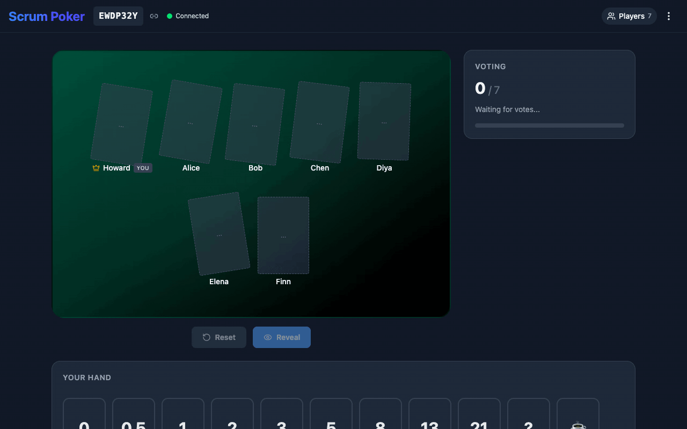
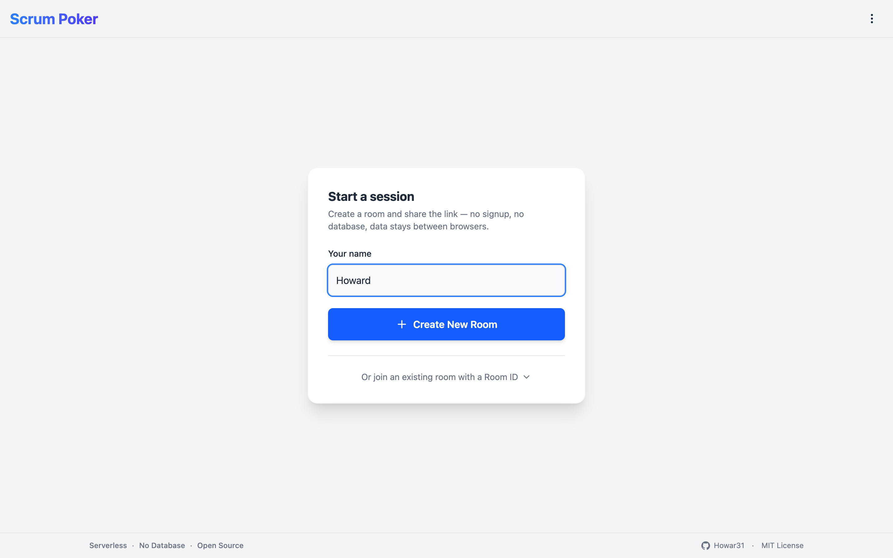
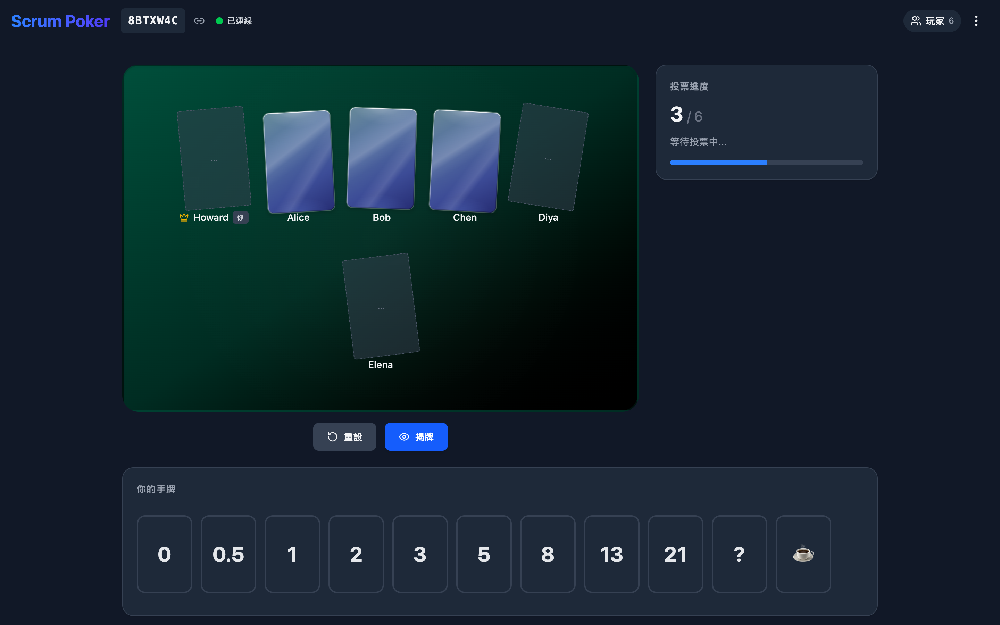
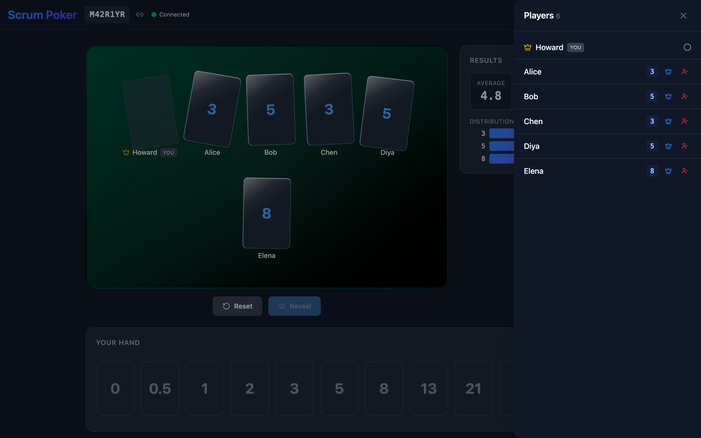
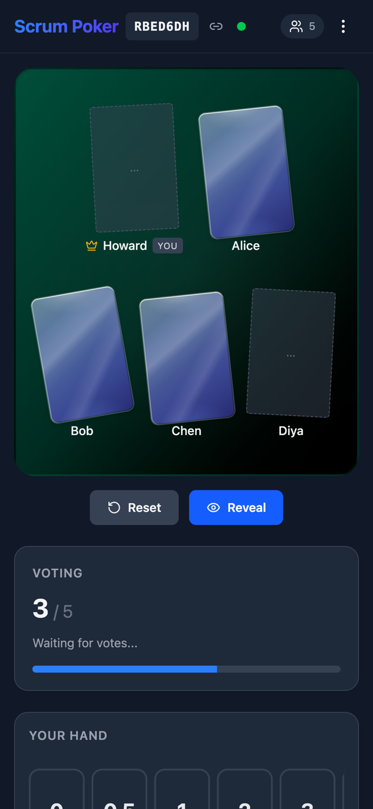
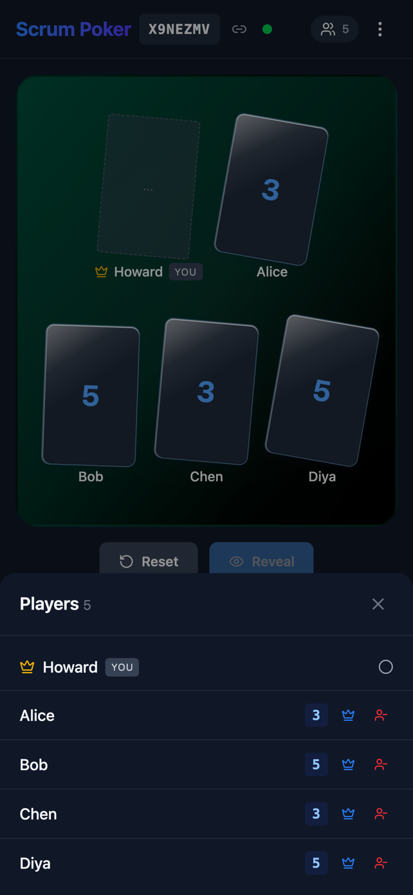
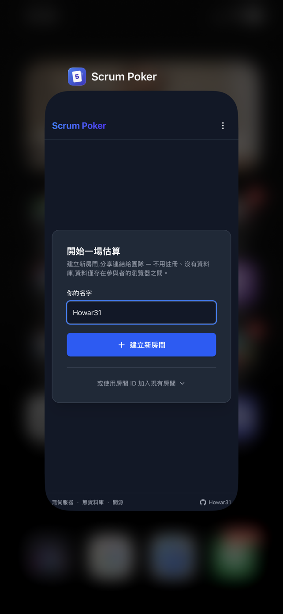

# Scrum Poker

[](LICENSE)
[](https://lab.howar31.com/scrum-poker/)
[](https://github.com/howar31/scrum-poker/actions/workflows/deploy.yml)
[](https://lab.howar31.com/hype-sign/)
[](https://github.com/howar31/scrum-poker/commits/main)
[](https://github.com/howar31/scrum-poker/pulse)
[](https://github.com/howar31/scrum-poker/issues)

**Serverless · No Database · Open Source** — A peer-to-peer scrum poker app that runs entirely in your browser. No backend, no signup, no tracking.

🔗 **Live**: [lab.howar31.com/scrum-poker/](https://lab.howar31.com/scrum-poker/)

<p align="center">
  
</p>

Built with React, Vite, TailwindCSS, and PeerJS. State lives in the participants' browsers and evaporates when the last person leaves — there is no database to store it in.

## Quick Start

*For facilitators & participants — no engineering knowledge required.*

Open the [live link](https://lab.howar31.com/scrum-poker/) in any modern browser (Chrome, Firefox, Safari, Edge). No account needed.

**Create a room** (facilitator)
1. Enter your name on the Home page and click **Create New Room**.
2. Share the Room ID (7 characters, e.g. `ABC1234`) or the full invite link with your team — the "copy link" icon next to the Room ID does both at once.

**Join a room** (participant)
- Either click the invite link someone sent you, or paste the Room ID into the Home page and click **Join Room**.

**During a round**
- **Vote**: tap a card in the bottom hand rail. Tap the same card again to unselect.
- **Reveal**: the host clicks **Reveal** when everyone's voted. The Statistics panel shows average / min / max / distribution; `?` and `☕` are excluded from the average.
- **Reset**: the host clicks **Reset** to clear all votes for the next story.

**Moderator actions** (host only — open the Players panel from the top right)
- **Transfer host**: click the crown icon next to a player, then click again to confirm. The room keeps running during the handoff.
- **Kick**: click the kick icon, then click again to confirm.

**Leave**
- Menu (top right) → **Leave room** → click again to confirm. If you were the host, the room automatically picks a new one.

**Add to Home Screen** (optional): on iOS Safari, tap Share → *Add to Home Screen*; on Android Chrome, use the browser menu → *Install app*. It opens as a standalone app with no browser chrome, like a native client.

**Browser compatibility note**: if you use **Arc Browser**, the app will warn you on Home and advise not to take the Host role. See [Known Limitations](#known-limitations) below.

## Screenshots

### Desktop

| Home (Light) | Voting (Traditional Chinese) | Players panel |
| :---: | :---: | :---: |
|  |  |  |

### Mobile

| Room | Bottom sheet | PWA on iOS |
| :---: | :---: | :---: |
|  |  |  |

## Features

- **Zero-Split-Brain Host Migration.** When the host leaves or crashes, exactly one client becomes the new host — *structurally* guaranteed, not by convention. The PeerJS broker's one-peer-per-ID constraint is the single arbiter: clients race to open the room's well-known ID, the broker hands it to one winner, every other caller becomes a follower. Every message carries a monotonic `epoch` so stale broadcasts from a previous host can never overwrite fresh state. If the designated successor crashes mid-handoff, non-electors unlock a rank-staggered fallback (rank 0 = original host usually) so the room survives. Graceful transfers settle in ~5–10 s; dirty crashes up to ~60 s. A 20 s ghost-sweep after migration keeps the player list accurate when someone doesn't make it back. Full FSM + protocol in [`SPEC.md`](SPEC.md).
- **Regression-Locked P2P Testing.** 26 Puppeteer e2e modes — every past P2P race condition has a dedicated test that reproduces it headless in CI: `split-brain` (5-client cross-network strand), `crash-mid-transfer`, `election-race`, `partition`, `network-flap`, `ice-restart`, `deadman`, `kick-window`, `late-joiner`, and more. `npm run e2e:all` cross-checks the zustand store via a test-only hook and exits non-zero on any regression. See the [Modes table](#modes) below.
- **Reconnect-aware Identity.** `playerId` persists across page reloads, so refreshing is a reconnect (same seat, same `joinedAt` rank for host-election ordering), not a duplicate join. An 8 s application-layer watchdog on top of a 2 s STATE heartbeat detects a dead host faster than WebRTC's native ICE timeout (15–30 s) while still tolerating brief network blips without evicting anyone. If the WebSocket to the PeerJS broker drops (tab backgrounded), the app auto-reconnects behind the scenes.
- **Installable PWA.** Ships a full Web App Manifest + `apple-touch-icon` set, so iOS Safari and Android Chrome can Add-to-Home-Screen with a proper icon and open the app in `standalone` display — no browser chrome, looks like a native client. Useful for recurring estimation sessions; one tap instead of typing the URL.
- **Serverless & P2P.** Every vote, message, and state update flows peer-to-peer via WebRTC. The only server in the loop is PeerJS's public signaling broker, which WebRTC requires to introduce browsers to each other at connection-setup time — it never sees your votes, names, or room state. Once peers are connected, the broker is out of the loop. Room data lives in participants' browsers and evaporates when the last person leaves.
- **Resilient Joins.** A new joiner arriving mid-migration gets a cancellable retry form with a spinner and a progress message that distinguishes "can't find this room yet" from "host isn't responding". After 30 s, a non-blocking banner offers Dismiss (keep retrying) or Give up. Walk away, come back, or bail out at any time.
- **Honest Connection Status.** A three-state dot in the header — green live, yellow (pulsing) reconnecting, red (pulsing) disconnected. Desktop shows the label inline; mobile stays icon-only and a tap toasts the full explanation.
- **Mistake-proof Entry.** The Home page shows only one primary action at a time — Join when you arrive via an invite link, Create otherwise — so you can't accidentally click the wrong button.
- **Readable Room IDs.** 7-character Crockford Base32 (no confusable `0/O`, `1/L/I`, `U/V`) — dictable verbally. The input field normalises common mistypes (`I→1`, `L→1`, `O→0`) so voice-relayed IDs still work.
- **Players Panel with Two-Step Moderator Actions.** A drawer (right-side desktop, bottom sheet mobile) lists every player with vote status and host crown. Transfer host and kick live here with a two-click arm-and-confirm (3 s auto-disarm) so you can't misfire on a quick tap. Kicked users return to Home and won't auto-reconnect.
- **Table-style Layout + Live Statistics.** Every played card is laid out on a felt table so votes are visible at a glance, even with 8+ players. A Statistics panel shows Average, Min, Max, Consensus badge, and vote distribution the moment cards are revealed (`?` and `☕` excluded from the average).
- **Rich Card Effects.** Pointer-tracked 3D tilt, crystalline glass-style card back, and a physical "pick up → flip → place down" reveal animation. Hand cards lift on hover; played cards lean at natural angles on the table. Honored by the "Reduce Motion" toggle.
- **Arc Browser Warning.** Arc's WebRTC stack doesn't play well with other browsers; the app detects Arc and surfaces actionable guidance on Home (including the recommendation to let someone else be Host). See [Known Limitations](#known-limitations).
- **i18n, theming, accessibility, responsive.** English + Traditional Chinese (auto-detected, persisted). Dark / Light theme. "Reduce Motion" kill-switch for animations. Fully responsive mobile + desktop.

## Development

### Prerequisites

Node 22 (pinned via `.nvmrc`). With [nvm](https://github.com/nvm-sh/nvm) installed:

```bash
nvm use           # or `nvm install` if 22 isn't installed yet
```

Vite requires Node ≥ 20.19 / 22.12 — older versions crash at startup.

### Install Dependencies

```bash
npm install
```

### Start Local Server

```bash
npm run dev
```

### Build for Production

```bash
npm run build
```

### Lint

```bash
npm run lint
```

### Regenerate PWA icons

After editing `public/icon.svg`, rasterize the PNG variants (`apple-touch-icon.png`, `icon-192.png`, `icon-512.png`) via a one-off Puppeteer script:

```bash
npm run icons
```

Output is committed so production builds don't need Puppeteer.

### Regenerate README screenshots

The screenshot showcase under `docs/screenshots/` (desktop / mobile stills + the animated `hero.gif`) is produced by a Puppeteer driver that spawns a host + several bots against a running dev server, drives the UI into each target state (including two rounds for the hero — disagreement → consensus), and pipes the captured WebM through `ffmpeg`'s palette filter into a compact GIF:

```bash
npm run dev           # in one shell
npm run screenshots   # in another; needs ffmpeg on PATH
```

The mobile captures are intentionally sized to match the user-supplied `pwa.png` (642×1389) so the README 3-column mobile gallery aligns at identical heights. `hero.gif` typically lands around 2 MB.

### End-to-end browser automation

A Puppeteer-based test harness (entry `scripts/e2e.js`, mode files in `scripts/e2e/modes/`, shared utilities in `scripts/e2e/helpers.js`) covers 24 modes — from smoke tests and load simulation to regression locks on every P2P race condition fixed so far. Everything targets `data-slot` attributes so i18n and CSS changes don't break tests.

**Fastest way to run the whole suite:**

```bash
VITE_E2E=1 npm run dev     # in one shell
npm run e2e:all            # in another; exits 0 iff every mode passes
```

#### Prerequisites

- Either `npm run dev` (or `VITE_E2E=1 npm run dev` for modes that introspect store state — see below) or pass `--url https://your-deployment/` to target a deployed build.
- Puppeteer is already a devDependency; `npm install` is sufficient.
- **`VITE_E2E=1`** on the dev server exposes `window.__POKER_STATE__` so helpers can read the zustand store directly. Production builds never ship this. Modes that rely on it: `vote`, `refresh`, `state-persist`, `deadman`, `settings`. Safe to always set it.

#### Modes

Every mode has an `e2e:<name>` npm shortcut. The full flag list is in `npm run e2e -- --help`.

| Mode | Shortcut | Exits? | What it does | Passes when... |
| --- | --- | --- | --- | --- |
| `host` | `e2e:host` | No (SIGINT) | Create room, stay alive. `--duration <sec>` makes it finite. | Room ID printed. |
| `swarm` | `e2e:swarm` | No (SIGINT) | N random-voting clients into `--room`. `--verbose N` forwards console. | Kill with Ctrl-C. |
| `e2e` | `e2e:check` | **Yes (0/1)** | Host + N clients; asserts every TesterNN is visible. | Exit code 0. |
| `observe` | `e2e:observe` | No (SIGINT) | Single client + full console forwarding. | Manual. |
| `transfer` | `e2e:transfer` | No (SIGINT) | Graceful host transfer (HOST_LEAVING + ACK + direct-connect + reclaim). | `allInRoom=true playerCountMatches=true`. |
| `crash` | `e2e:crash` | No (SIGINT) | Host page abruptly closed. Drives heartbeat → probe → handleHostDisconnect → self-promote. | `allInRoom=true playerCountMatches=true`. |
| `kick` | `e2e:kick` | No (SIGINT) | Host kicks Tester01; waits past 5 s reject window. | `tester01Left=true survivorsInRoom=true playerCountMatches=true`. |
| `vote` | `e2e:vote` | No (SIGINT) | Full vote → reveal → reset cycle; asserts Statistics `average=4 min=3 max=5` (☕ excluded) and reset clears state. | `votesRecorded=true statsCorrect=true resetClears=true`. |
| `refresh` | `e2e:refresh` | No (SIGINT) | Client reloads mid-session; asserts same playerId (no duplicate), documents vote-loss. | `sameCount=true noDuplicates=true voteLostAsExpected=true`. |
| `state-persist` | `e2e:state` | No (SIGINT) | Votes + isRevealed survive host transfer. | `votesPreserved=true revealedPreserved=true statsStable=true`. |
| `kick-window` | `e2e:kick-window` | No (SIGINT) | 5 s kicked-ID reject window blocks auto-reconnect, but manual re-join works afterwards. | `kickedLanded=true blockedWithinWindow=true rejoinAfterWindow=true`. |
| `late-joiner` | `e2e:late-joiner` | No (SIGINT) | Fresh client joins during a host transfer. | `lateJoined=true allInRoom=true playerCountConverges=true`. |
| `deadman` | `e2e:deadman` | No (SIGINT) | Transfer to non-oldest, kill successor mid-flight; rank-0 original host recovers. | `hostRecovered=true survivorsInRoom=true`. |
| `disarm` | `e2e:disarm` | No (SIGINT) | Arm kick, wait > 3 s, assert `data-confirming` cleared and next click re-arms. | `autoDisarmed=true reArmsNotConfirms=true tester01Stays=true`. |
| `join-ux` | `e2e:join-ux` | No (SIGINT) | Home URL routing, Room ID normalization (`ILO123` → `110123`), cancel works. | `createShownAtRoot=true joinShownWithRoom=true normalized=true cancelWorks=true`. |
| `settings` | `e2e:settings` | No (SIGINT) | Theme / language / animations toggles + theme persistence across reload. | `themeFlips=true themePersists=true languageFlips=true animationsToggle=true`. |
| `copy-toast` | `e2e:copy-toast` | No (SIGINT) | copy-room-id + copy-invite-link surface toasts; toasts auto-dismiss in 4.5 s. | `roomIdToast=true linkToast=true toastsAutoDismiss=true`. |
| `solo-leave` | `e2e:solo-leave` | No (SIGINT) | Solo host leaves via menu (arm + confirm); URL `?room=` stripped. | `leftAfterConfirm=true backOnHome=true urlCleaned=true`. |
| `panel-ux` | `e2e:panel-ux` | No (SIGINT) | Players panel closes via X, Escape, and backdrop click. | `xCloses=true escapeCloses=true backdropCloses=true`. |
| `split-brain` | `e2e:split-brain` | No (SIGINT) | 1 host + 5 clients, host transfers to Tester01. Regression lock for the cross-network split-brain bug. | `allInRoom=true playerCountMatches=true hostIdConsistent=true noSoloHosts=true`. |
| `crash-mid-transfer` | `e2e:crash-mid-transfer` | No (SIGINT) | Transfer to Tester02 then kill them before they elect. Rank-0 fallback recovers. | `hostRecovered=true allInRoom=true playerCountMatches=true`. |
| `election-race` | `e2e:election-race` | No (SIGINT) | Force-close host, four clients race for the well-known ID. Broker arbitrates → exactly one winner. | `exactlyOneHost=true everyoneAgrees=true allInRoom=true playerCountMatches=true`. |
| `partition` | `e2e:partition` | No (SIGINT) | Two clients leave simultaneously via menu. Majority stays together, no dangling players. | `majorityInRoom=true majorityCountMatches=true hostStill=true minorityLeftRoom=true`. |
| `network-flap` | `e2e:network-flap` | No (SIGINT) | One client toggles Puppeteer offline mode for 4 s. Window `online`/`offline` listeners trigger a recovery without forcing a host migration. (Blocks HTTP / WebSocket, not UDP.) | `stayedInRoom=true noMigration=true playerCountStable=true recovered=true sawReconnecting=true`. |
| `ice-restart` | `e2e:ice-restart` | No (SIGINT) | Invokes `window.__POKER_PEER__.restartIce()` directly. Asserts DataConnection survives and the store cycles through `reconnecting-ice` → `connected`. | `hookFired=true stayedInRoom=true noMigration=true playerCountStable=true recovered=true sawIceReconnecting=true`. |
| `all` | `e2e:all` | **Yes (0/1)** | Runs every assertion mode as a child process, aggregates pass/fail. | Exit code 0. |

Assertion-mode pass criterion: the final `Result: ...` line has every field `=true`. Any `=false` means a regression. `check` and `all` are the only modes with actual exit codes; for the others, grep stdout or use `e2e:all` to wrap them.

#### Examples

```bash
# Run the full suite (recommended in CI)
VITE_E2E=1 npm run dev &
npm run e2e:all

# Single assertion modes
npm run e2e:check -- --count 5
npm run e2e:vote
npm run e2e:transfer -- --count 3
npm run e2e:deadman

# Create a room on the deployed site and keep it alive
npm run e2e:host -- --url https://lab.howar31.com/scrum-poker

# Load-test: 10 random-voting clients into an existing room
npm run e2e:swarm -- --url https://lab.howar31.com/scrum-poker --room ABC1234 --count 10

# Debugging a P2P bug: single client + full console forwarding
npm run e2e:observe -- --room ABC1234
```

## Deployment

The production instance is at [lab.howar31.com/scrum-poker/](https://lab.howar31.com/scrum-poker/). It's auto-deployed to GitHub Pages on every push to `main` via `.github/workflows/deploy.yml`. To host your own copy: fork the repo, update the `homepage` in `package.json`, and enable GitHub Pages in the repo settings.

## TURN configuration

The default build uses **STUN-only** ICE (Google + Twilio public servers). This works for most home networks, but fails for peers behind symmetric NAT, corporate firewalls that block UDP, or browsers with aggressive WebRTC privacy settings (Arc, Brave). To cover those cases, you can plug in a TURN provider via environment variables. TURN is a fallback — direct peer-to-peer is always tried first, so configuring TURN doesn't increase your bandwidth use unless a peer pair genuinely can't connect directly.

Two providers are supported in parallel; you can configure either or both, and ICE will pick whichever relay candidate succeeds first:

| Provider | Free tier | Credit card | OSS-safe creds | Region |
|---|---|---|---|---|
| **Open Relay** (Metered.ca) | 20 GB / month | Not required | Yes — credentials are intentionally public | US only |
| **Cloudflare TURN** | 1,000 GB / month (shared with Realtime SFU) | Required | Only via the bundled Worker (never ship the API key) | Global anycast |

For a typical Scrum Poker session (~1 KB STATE every 2 s × N peers, only the relay-bound subset hitting TURN), 20 GB is enough for thousands of meetings.

Setup:

1. Copy `.env.example` to `.env.local` and uncomment the variables for whichever provider you choose.
2. **Open Relay only**: sign up at [metered.ca/tools/openrelay](https://www.metered.ca/tools/openrelay/) and paste the username / credential.
3. **Cloudflare**: deploy the bundled Worker at `infra/turn-token-worker/` (`wrangler deploy`), set `TURN_KEY_ID` / `TURN_KEY_API_TOKEN` as Worker secrets, and put the Worker URL in `VITE_TURN_CF_TOKEN_URL`. The Worker mints short-lived (4 h) credentials on demand so the API key never reaches the client.
4. For GitHub Pages deployments, set the `VITE_TURN_*` values as repository secrets and reference them in the deploy workflow.

If a TURN fetch fails at runtime (Worker outage, network blip), the app degrades silently to STUN + whichever provider succeeded — TURN is never on the critical path of joining a room.

## Known Limitations

- **Depends on a third-party signaling broker.** WebRTC needs a signaling relay to bootstrap peer-to-peer connections; we use PeerJS's free public broker (`0.peerjs.com`). If the broker has an outage, **new** rooms can't be created and **new** joiners can't reach existing rooms; already-connected participants keep working over their direct WebRTC channel until someone disconnects. Self-hosting a [PeerServer](https://github.com/peers/peerjs-server) is straightforward if you need an uptime guarantee — the code makes no assumption about who runs the broker.
- **No TURN by default.** STUN-only is the out-of-the-box configuration; peers behind symmetric NAT, corporate firewalls blocking UDP, or browsers with aggressive WebRTC privacy settings will fail to connect until you configure a TURN provider. See [TURN configuration](#turn-configuration) above.
- **Arc Browser as Host is broken in practice.** Arc's WebRTC stack is not fully compatible with Chrome/Firefox peers: ICE negotiation gets stuck in `checking` indefinitely or flaps between `connected`/`disconnected`. This affects **both new joiners** arriving via invite link AND **existing clients** trying to reconnect after a host transfer. In real-world testing with 5 clients (2 Chrome, 2 Firefox, 1 Arc), any scenario where Arc holds the Host role consistently stranded the Chromes.
  - **Recommendation for Arc users**: don't take the Host role. That is — don't click "Create room", and don't accept being made Host via the players panel. Joining as a regular follower mostly works.
  - **Mitigation**: open `arc://flags`, search for *"Anonymize local IPs exposed to WebRTC"*, set it to **Disabled**, then restart Arc. This *reduces* but does **not fully eliminate** the problem — in our testing Chromes still failed to connect to an Arc Host with this flag disabled, just slightly less often.
  - **Workaround**: use Chrome, Firefox, or Safari for creating rooms. The app detects Arc and surfaces an in-app warning with this guidance.
